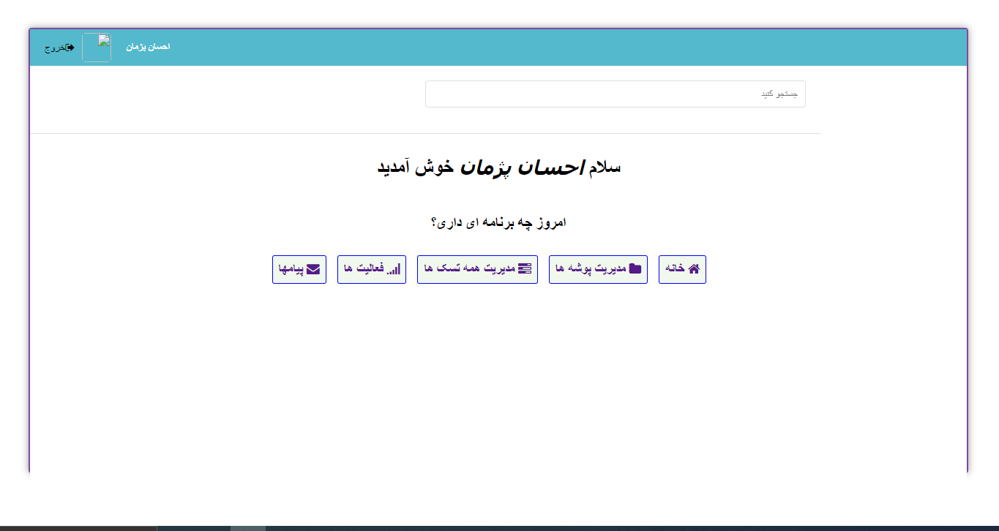

  
  <h3 align="center">Simple ToDo Project</h3>
  <h5 align="center">version 1.0.0-beta (jun 6 2023)</h5>
  

    Easy management of Tasks!
     
    |
    <a href="https://github.com/EhsanPazhman/Todo/issues">Report Bug</a>
    |
     <a href="https://github.com/EhsanPazhman/Todo/issues">Request Feature</a>
  

## Table of Contents
- [Table of Contents](#table-of-contents)
- [About Todo Project](#about-todo-project)
- [Built with](#built-with)
- [Setup training](#setup-training)
- [Features](#features)
- [Features in future updates](#features-in-future-updates)
- [Screenshot](#screenshot)
- [Important things](#important-things)
- [Bugs in the project](#bugs-in-the-project)
- [Contact with me](#contact-with-me)
- [License](#license)

## About Todo Project
This project is licensed under the terms of the MIT license and developed by Ehsan Pejman.
This project in beta version and has also been developed procedurally.
This project has been developed and commented in Persian language and 
 give feedback or request features that you would like to be added to the project.
be successful and victorious.

## Built with
- PHP 8
- HTML 5
- CSS 3
- JQuery 3.5.1
- Ajax
- MariaDB 10.4.17 (You can use MySQL and...)
- DB-Connection (PDO)

## Setup training
 1. Create a database of your choice and import the tables from the database.sql file at the root of the project.
 2. Enter the bootstrap folder and set your database information in the config.php file.
 3. Enter the bootstrap folder and set your information in the constants.php file.

## Features
- Welocome to the user
- Register and login users
- password recognition for the user
- Verify the user's email
- BCRYPT method to store user password
- User logout
- Prevent sql injection
- Utf8mb4 character
- Use Ajax
- Create a folder
- Manage folders
- Manage all tasks
- Task folder in single page
- Create tasks
- Change task status
- Edit task names
- Edit folder names
- Search for tasks
- Delete folders
- Delete tasks
- Persian language
- High speed

## Features in future updates
- Improved UI
- Responsiveness of the whole project
- Reset Password
- Login using social networks
- Report a problem
- Add tags to tasks
- Add descriptions to tasks
- Added files to tasks
- Set the task as important
- Filter tasks and folders
- English language (in the stable version)
- and more...

## Screenshot

## Important things
 1. This app can be used on mobiles and tablets but has not yet been optimized for these devices.
 2. Your pull requests are all reviewed and accepted if possible.

## Bugs in the project
My good friend, if you find a bug in the project, you can let me and other friends know via GitHub. [https://github.com/EhsanPejman/Todo/issues](https://github.com/EhsanPazhman/Todo/issues)

## Contact with me
 - By Email [ehsanpazhman@gmail.com](mailto:ehsanpazhman@gmail.com)

## License

This project is licensed under the terms of the MIT license. © [Ehsan Pazhman](https://github.com/EhsanPazhman/Todo)
